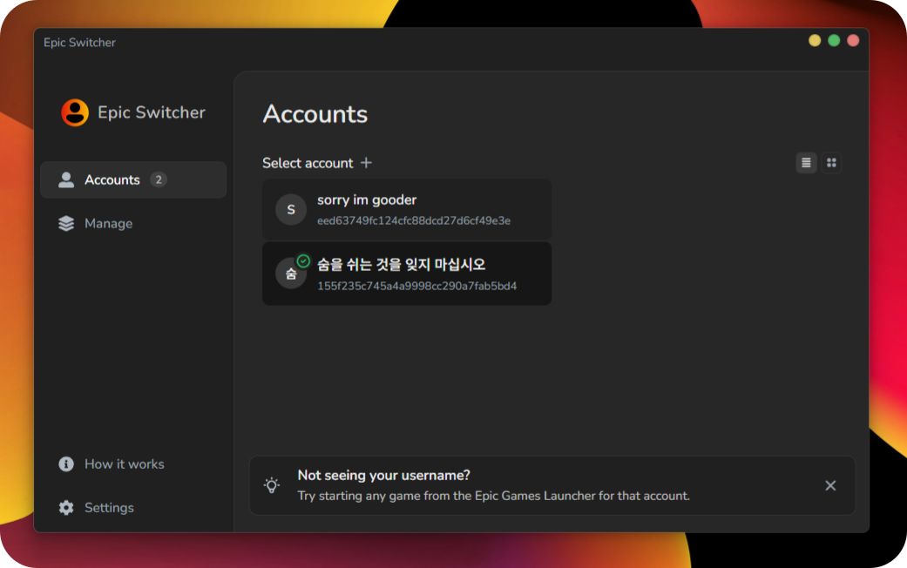
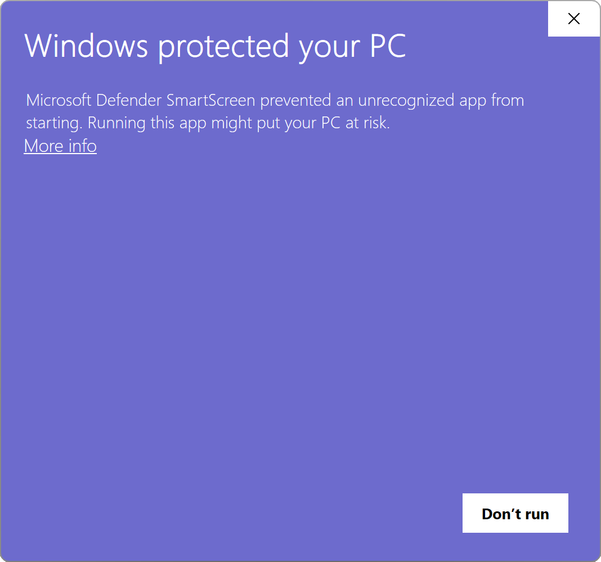
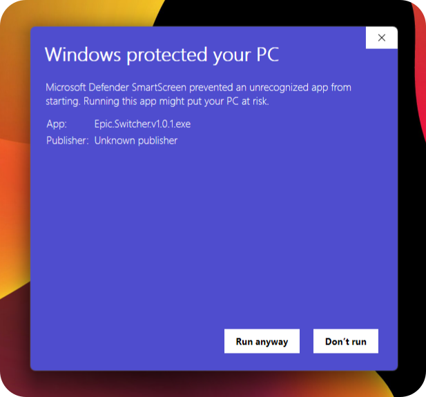
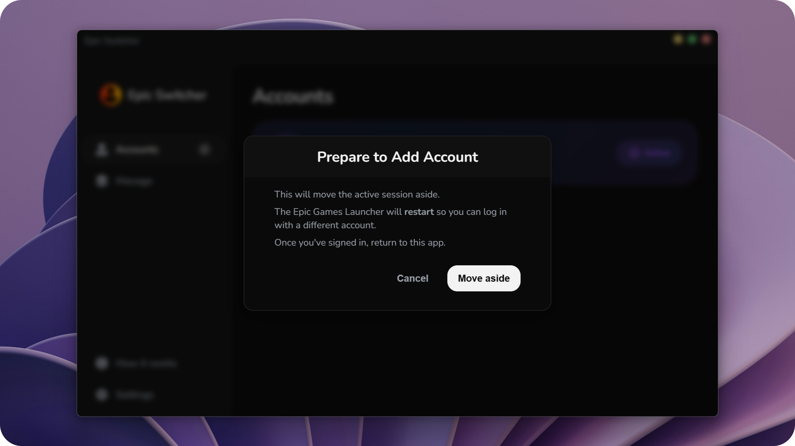
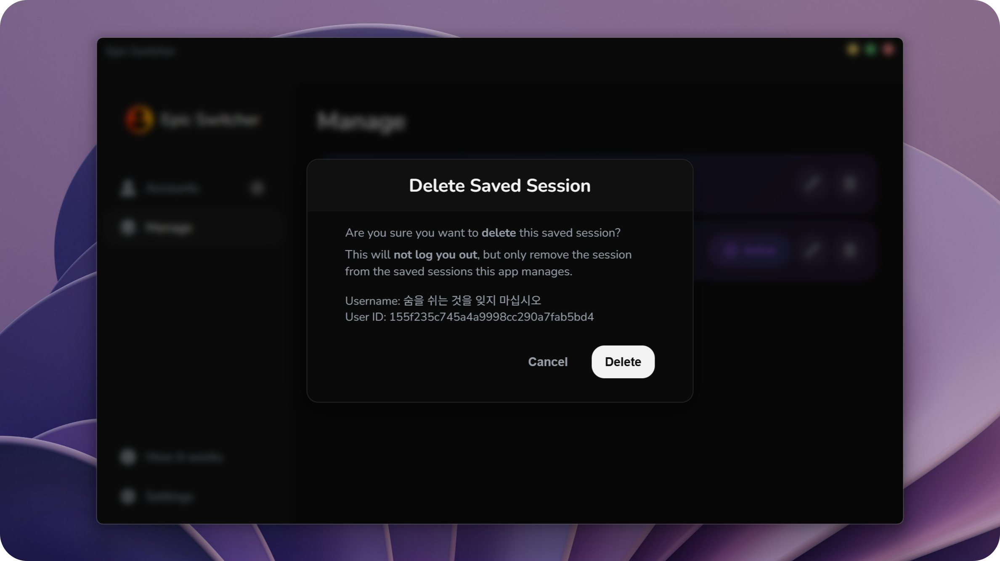
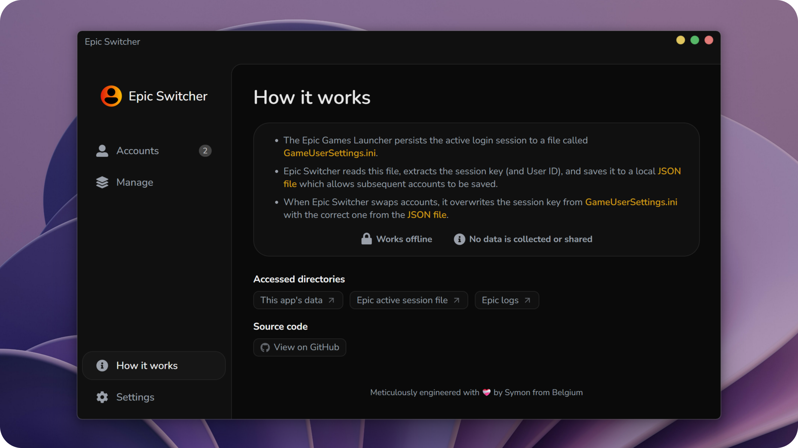
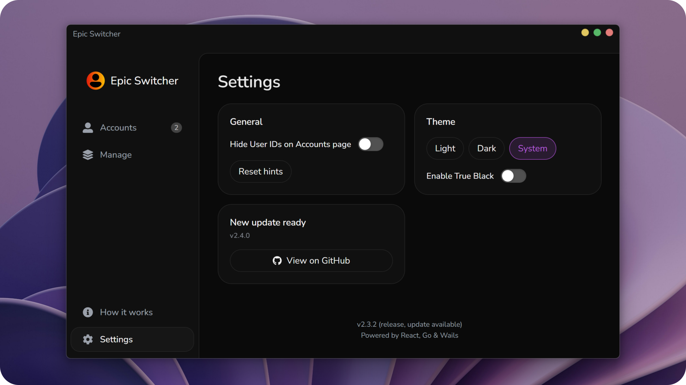

<div align="center">
  <a href='' target="_blank">
    
  </a>
  <h1>Epic Switcher</h1>
</div>

- Epic Switcher is designed to facilitate switching between accounts in the Epic Games Launcher  
- Currently only for Windows

<br/>

<div align="center">
  
</div>

## 📥 Downloads
- Grab the latest version from the [**Releases page**](https://github.com/symonxdd/epic-switcher/releases/latest)  
- No install required

<br/>

> [!TIP]
> GitHub 'Releases' is GitHub jargon for downloads.

<br/>

<details>
<summary>
<strong>⚠️ What's the "Windows protected your PC" message?</strong>
</summary>

### ⚠️ Windows SmartScreen Warning
When you run the app for the first time on Windows, you might see a warning like this:

<div>
  
  <br/><br/>
  
</div>

### 🧠 What's actually happening?

This warning appears because the app is **new** and **hasn't yet built trust** with Microsoft SmartScreen, **not because the app is malicious**.

According to [Microsoft's official documentation](https://learn.microsoft.com/en-us/windows/security/operating-system-security/virus-and-threat-protection/microsoft-defender-smartscreen/), SmartScreen determines whether to show this warning based on:

- Whether the file matches a **known list of malicious apps** or is from a **known malicious site**
- Whether the file is **well-known and frequently downloaded**
- Whether the app is **digitally signed** with a costly trusted certificate

This is **just a generic warning** — many indie or open-source apps trigger it until they build trust or pay for expensive certificates.

### ✅ How to dismiss and run

1. Click **"More info"**
2. Click **"Run anyway"**

### 🤨 Why not prevent the warning

To fully avoid SmartScreen warnings on Windows, developers are expected to:

- Buy and use an **EV (Extended Validation) Code Signing Certificate**  
- Have enough users download the app over time to build a strong **reputation score**

These certificates can cost **hundreds of dollars per year**, which isn't always feasible for solo developers or small open-source projects.  
We're focused on keeping this tool free and accessible.  
> For full details on how SmartScreen works, check out [Microsoft's official documentation](https://learn.microsoft.com/en-us/windows/security/operating-system-security/virus-and-threat-protection/microsoft-defender-smartscreen/)

Thanks for supporting open-source software! 💙

</details>

<br/>

## 💡 Motivation

Epic Switcher started the same way most of my projects do: **I, or people around me needed it.**

Not too long ago, my siblings and I used to play Fortnite together. At some point, I gave her my main Fortnite account since I wasn't playing much anymore, which meant I had to make a separate account to play with them.

Aside from Fortnite (which I don't really play anymore), I'm really into Rocket League, and that's on my main account — the one I gave her. So I was constantly switching between Epic Games accounts, and the official launcher makes that way slower and more annoying than it should be. Logging out, logging back in, re-entering credentials, and dealing with 2FA almost every time got frustrating fast.

Existing solutions were either over-engineered, had outdated UIs, or were bundled with features I didn't want. I just wanted something:

- Fast
- Minimal
- One-click

So I built Epic Switcher. Once it proved useful, I open-sourced it in case it helps others with the same problem.

<br/>

## 🖼️ Screens  

### Accounts page


<br/>

### Add Session modal


<br/>

### Manage page


<br/>

### Delete Session modal
 

<br/>

### How it Works page
 

<br/>

### Settings page
 

<br/>

> [!NOTE]
> **Developer section below:** The following content is intended for developers interested in the inner workings of Epic Switcher.

<br/>

## 🗂️ Project Layout
Here's a quick overview of the main files and folders:
```
epic-switcher/
├── .github/
│   └── workflows/
│       └── release.yml         # GitHub Actions workflow for cross-platform builds + releases
│
├── backend/                    # Go backend logic
│   ├── helper/                 # Cross-platform utilities and command wrappers
│   │   ├── command_default.go  # Default command runner (used on non-Windows)
│   │   └── command_windows.go  # Windows-specific command runner (hides terminal window)
│   ├── models/                 # Data structures (LoginSession)
│   └── app.go                  # Main backend bindings exposed to the frontend
│
├── build/                      # App icons, packaging resources, and Wails build outputs
│   └── appicon.png             # Icon used for the app window and release packages
│
├── frontend/                   # Vue 3 frontend (served with Vite)
│   ├── src/
│   │   ├── main.jsx            # React app entry point
│   │   └── App.jsx             # Root React component
│   └── index.html              # HTML entry point
│
├── go.mod                      # Go dependencies (the Go module manifest)
├── go.sum                      # Go dependency checksums
├── main.go                     # App entry point (launches Wails)
├── release.js                  # Script to automate version bumping and pushing a new release
├── wails.json                  # Wails project configuration
└── README.md                   # You're reading it ✨
```

> [!NOTE]
> The two files at `app/helper/command_*.go` are **OS-specific** and use [Go build tags](https://pkg.go.dev/go/build#hdr-Build_Constraints) to automatically select the correct one during build time. This ensures clean handling of platform quirks without any runtime checks.

<br/>

## 🔧 Dev Prerequisites
- To build or run in dev mode, follow the [official Wails installation guide](https://wails.io/docs/gettingstarted/installation).  
- You'll need Go installed, along with Node and a package manager like `npm`, `yarn`, or `pnpm`.

<br/>

## ⚙️ Live Development
To start the app in dev mode:
```bash
wails dev
```

<br/>

## 📦 Release Build
To generate a production-ready, standalone binary:
```bash
wails build
```
This compiles the app and outputs a native executable, ready to distribute.

<br/>

## 🚀 Release Workflow
Epic Switcher uses a fully automated release pipeline powered by **GitHub Actions** and a helper script.

To create a new release, I run the release script:
```bash
npm run release
```

This will:

1. Prompt to select the version type (`Patch`, `Minor`, or `Major`)
2. Bump the version in `frontend/package.json`
3. Commit the version bump and create a Git tag
4. Push the commit and tag to GitHub

> [!NOTE]
> The version bump uses a clear commit message like: `chore: bump version to v1.2.3`

When a `v*` tag is pushed, the [`release.yml`](.github/workflows/release.yml) GitHub Actions workflow is triggered.

- 🔧 Builds a native binary for Windows (.exe).
- 🗃 Renames and organizes the build artifacts.
- 📝 Creates a new GitHub Release and uploads the binary with an OS-specific label.

💡 The release process can be viewed under the repo's **Actions** tab

<br/>

> [!NOTE]
> _Thanks to my previous work on my other project (AVD Launcher), I already had a release pipeline ready. It only required minor adjustments to fit this project._

<br/>

## Built with ❤️
This project is built with:
- [Wails](https://wails.io/)
- [Go](https://go.dev/)
- [React](https://react.dev/)

### Credits 
- Logo symbol by [Epicons](https://www.svgrepo.com/svg/355688/user-a-solid) from [SVGRepo](https://www.svgrepo.com/)
- Demo screenshot background by [Unsplash](https://unsplash.com/photos/a-close-up-of-a-cell-phone-with-a-purple-background-Cp4dn8_6Y5I)

<div align="center">
  <sub>Made with 💛 by Symon</sub>
</div>
<div align="center">
  <sub>Powered by <a href="https://wails.io/">Wails</a></sub>
</div>
